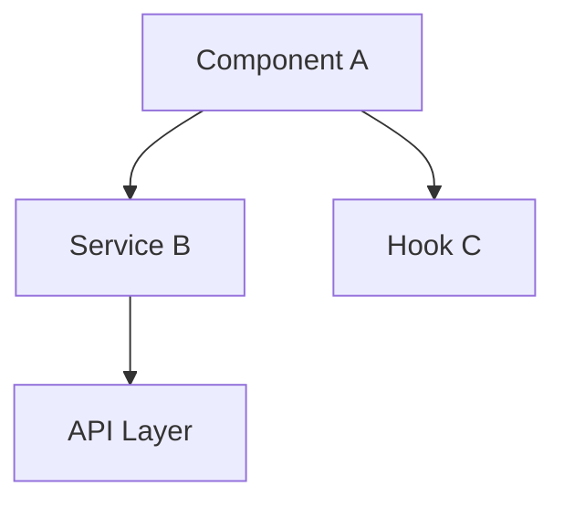
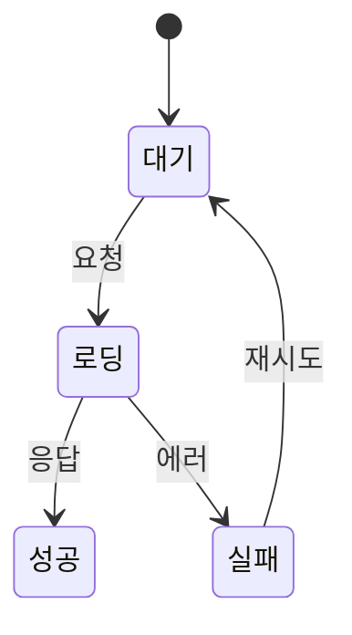

# PR 생성 스킬

## 핵심 규칙

### 절대 금지 사항
- **`🤖 Generated with Claude Code` 또는 `Co-Authored-By: Claude` 등 AI 생성 표시 문구를 PR 본문, 제목, 커밋 메시지 어디에도 절대 포함하지 않는다.**
- 이 규칙은 어떤 상황에서도 예외 없이 적용된다.

### 언어 규칙
- PR 제목과 본문은 **한국어**로 작성한다.
- 코드 블록, 파일 경로, 기술 용어는 영문 그대로 사용한다.

## PR 생성 절차

### 1단계: 상태 파악

다음 명령어를 **병렬로** 실행하여 현재 브랜치 상태를 파악한다:

```bash
# 1. 작업 트리 상태
git status

# 2. 스테이징/언스테이징 변경사항
git diff --staged && git diff

# 3. 리모트 트래킹 상태
git rev-parse --abbrev-ref --symbolic-full-name @{u} 2>/dev/null

# 4. 베이스 브랜치와의 차이 (커밋 히스토리 + diff)
git log <base-branch>...HEAD --oneline
git diff <base-branch>...HEAD --stat
```

### 2단계: 베이스 브랜치 결정

- 사용자가 베이스 브랜치를 지정한 경우 → 해당 브랜치 사용
- 지정하지 않은 경우 → `main` 브랜치를 기본값으로 사용

### 3단계: 변경사항 분석

**모든 커밋을 분석한다** — 최신 커밋만이 아니라, 베이스 브랜치에서 분기한 이후의 **전체 커밋**을 검토한다.

분석 항목:
- 변경된 파일 목록과 각 파일의 변경 유형 (신규/수정/삭제)
- 변경의 성격 (기능 추가, 버그 수정, 리팩토링, 설정 변경 등)
- 주요 로직 변경 포인트
- 영향 범위

### 4단계: PR 작성 및 생성

#### PR 제목 규칙
- 70자 이내
- 변경의 핵심을 한 문장으로 요약
- prefix 사용: `feat:`, `fix:`, `refactor:`, `chore:`, `docs:`, `test:`, `style:`

#### PR 본문 템플릿

```markdown
## 개요
<!-- 이 PR이 왜 필요한지, 어떤 문제를 해결하는지 1-3줄로 설명 -->

## 변경 사항
<!-- 주요 변경사항을 bullet point로 정리 -->
-

## 상세 설명
<!-- 복잡한 변경이 있을 경우 상세하게 설명 -->
<!-- 아키텍처 변경, 데이터 흐름 변경 등은 mermaid 다이어그램 활용 -->

## 테스트
<!-- 테스트 방법이나 확인 사항 체크리스트 -->
- [ ]
```

### Mermaid 다이어그램 활용 가이드

다음과 같은 경우 mermaid 다이어그램을 **상세 설명** 섹션에 포함한다:

**1. 데이터/처리 흐름이 변경된 경우:**

````markdown

````

**2. 컴포넌트/모듈 간 관계가 변경된 경우:**

````markdown

````

**3. 상태 변경 흐름이 있는 경우:**

````markdown

````

**다이어그램이 불필요한 경우:**
- 단순 버그 수정 (한두 줄 변경)
- 텍스트/스타일만 변경
- 설정값 변경
- 변경 범위가 단일 파일로 한정

### 5단계: 실행

```bash
# 필요 시 리모트 푸시
git push -u origin <branch-name>

# PR 생성
gh pr create --base <base-branch> --title "<제목>" --body "$(cat <<'EOF'
<PR 본문>
EOF
)"
```

생성 완료 후 PR URL을 사용자에게 반환한다.

## 주의사항

- 커밋되지 않은 변경사항이 있으면 먼저 사용자에게 알린다
- `--force` 푸시는 절대 하지 않는다
- PR 생성 전 리모트 브랜치가 최신인지 확인한다
- 민감한 파일(.env, credentials 등)이 포함되어 있으면 경고한다
