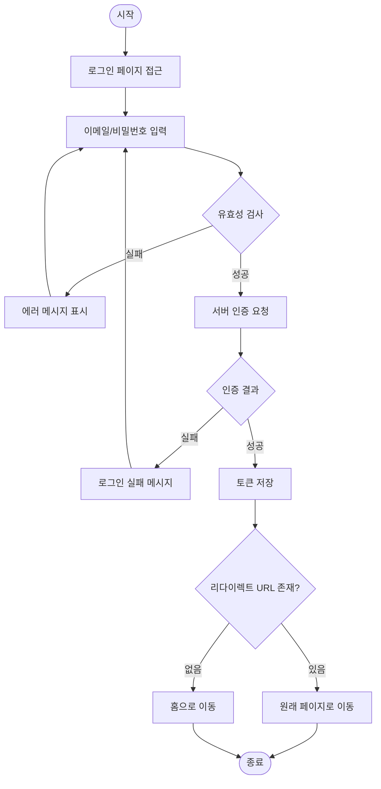
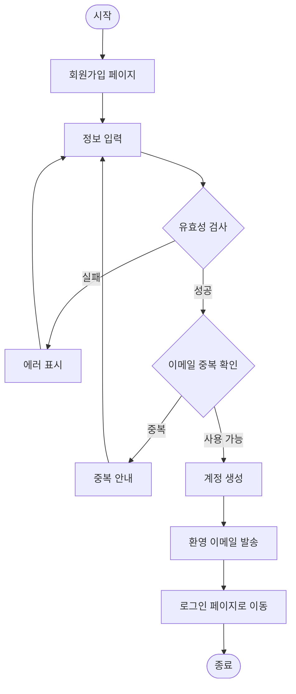

# 플로우차트 템플릿

## 의존 문서

- 기능명세서 (`features.md`) — 처리 로직, 예외 처리
- 정보구조도 (`sitemap.md`) — 페이지 간 이동 흐름

## 사용자에게 확인할 것

- 핵심 사용자 흐름 (어떤 플로우를 우선 정의할지)
- 분기 조건
- 에러 시 동작

## 템플릿

```markdown
# 플로우차트

| 항목 | 내용 |
|------|------|
| 프로젝트 | {프로젝트 이름} |
| 문서 버전 | v1.0 |
| 최종 수정일 | {YYYY-MM-DD} |
| 작성자 | {작성자} |
| 상태 | `초안` |

---

## 1. 플로우 목록

| ID | 플로우명 | 관련 기능 | 우선순위 |
|----|---------|---------|---------|
| FLOW-AUTH-001 | 로그인 플로우 | FEAT-AUTH-001 | High |
| FLOW-AUTH-002 | 회원가입 플로우 | FEAT-AUTH-002 | High |
| FLOW-{CAT}-001 | {플로우명} | FEAT-{CAT}-{번호} | {우선순위} |

---

## 2. 플로우 상세

### FLOW-AUTH-001: 로그인 플로우



**분기 조건:**
| 조건 | 결과 |
|------|------|
| 유효성 검사 실패 | 에러 메시지 표시 후 재입력 |
| 5회 이상 실패 | 30분 계정 잠금 |
| 인증 성공 | 이전 URL 또는 홈으로 이동 |

---

### FLOW-AUTH-002: 회원가입 플로우



---

### FLOW-{CAT}-001: {플로우명}

```mermaid
flowchart TD
    A([시작]) --> B[{첫 단계}]
    B --> C{조건}
    C -- Yes --> D[{처리}]
    C -- No --> E[{대안 처리}]
    D --> F([종료])
    E --> F
```

**분기 조건:**
| 조건 | 결과 |
|------|------|
| {조건} | {결과} |
```
